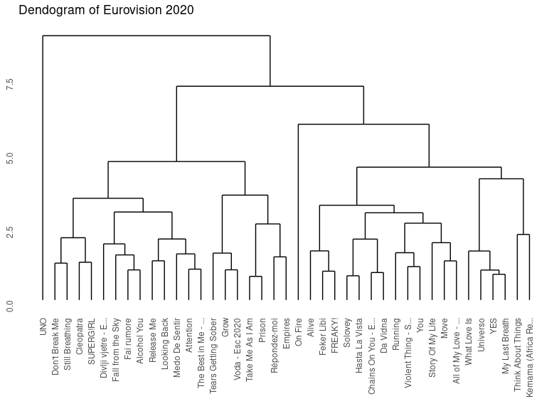

```{r setup, include=FALSE}
knitr::opts_chunk$set(echo = TRUE)

# include packages
library(flexdashboard)
library(readr)
library(tidyverse)
library(lubridate)
library(plotly)
library(patchwork)
library(spotifyr)
library(compmus)
library(purrr)
library(tidyr)
library(broom)
library(DT)
library(thematic)
library("ggpubr")


# include environment
load("~/CompMus/R_data.RData")
```


### **Introduction**: Sonfestival trough time {data-commentary-width=600}

<iframe width="100%" height="703" src="https://www.youtube.com/embed/DPzoydLh5YY" title="YouTube video player" frameborder="40" allow="accelerometer; autoplay; clipboard-write; encrypted-media; gyroscope; picture-in-picture" allowfullscreen></iframe>

***

**Katinka**

My little sister is named after the song "Kleine Kokette Katinka" by the Spelbrekers. This Dutch song, Netherland's submission for the Eurovision song contest in 1962, was the first song ever in the history of Eurovision to receive 0 points. I always thought this was very funny, and teased my sister with it. The video clip of "Kleine Kokkete Katinka" (shown on the right) always interested me: Eurovision has changed a lot since then.

**Eurovision**

Since 1956, the Eurovision song festival has been held every year (apart from 2020), making it the longest-running annual international televised music competition and one of the world's longest-running television programmes. What do you need to compete as a country? An original song of three minutes or less, to be performed live by an artist or group. This results in a wide variety of songs every year, which makes Eurovision a very interesting event to analyse musically.

My questions are the following: how have Eurovision songs changed over time? And is there a magic formula for making a successful and maybe even winning track? I am also interested in seeing if the development in Eurovision music is similar to the development of music in general. Research shows that over time the timbral palette gets more homogeneous, pitch transitions get more restricted and levels of loudness grow in music (Serrà, Corral, Boguñá, Haro, Arcos, 2012). 

**Corpus**

To answer these questions, a corpus has been created containing the songs from the grand finale of Eurovision from 1980-2020, which sums up to 965 songs in total. The analysis of this corpus will be done using the Spotify API. The Spotify API keeps track of various music features, like valence, danceability, energy and much more. 

What stands out about the corpus is the variety in the songs. These range from beautiful calm jazz waltzs like "Amar pelos dos" by Salvador Sobral (winner of 2017) to "Hard Rock Hallelujah", a, as the name might suggest, hard rock song performed by Lordi (winner of 2007). 

A link to the corpus is available on the last tab.


### **Trends** in Eurovision {data-commentary-width=600}
 
```{r, echo = FALSE, message = FALSE}

ggplotly(trends + theme_minimal() + theme(legend.title = element_blank()))
```
***

**Overview**

Before we can start with a depth analysis, it might be nice to get an overall look of Eurovision and some of the track-level features from the Spotify API. This first plot serves as an overview of the global trends in Eurovision songs. The means of the Spotify's API features acousticness, danceability, energy and valence are shown over time. The fun thing about Eurovision is that it is very well documented, and the effect of historical events or stand out:

- There is a drop in acousticness around 1999;
- In 1995 there seems to be a drop in acousticness, danceability and energy;
- The energy seems to be gradually going up, while valence seems to be going down.

**The drop in acousticness**

Around 1997 - 1999 the acousticness of Eurovision songs drops fast. This can be explained by a change in the rules of Eurovision. A live orchestra was a prominent feature of Eurovision from 1956-1998. In 1973 pre-recorded backing tracks were also allowed, but only if the instruments could still be seen 'playing' on stage. In 1997 it became allowed to pre-record all instrumental music, but the host country was still required to provide a live orchestra. From 1999, even the orchestra became optional, and as a cost-saving measure, 1999 therefore became the first ver Eurovision without an orchestra, meaning all the instrumentals were pre-recorded. Present day all instrumentals have to be pre-recorded, with only the singing remaining live (Wikipedia, 2022). It's very nice to see how the history of Eurovision can be seen in the statistics of just a simple line plot. 

**1995**

I have not found an explanation for the drop in valence, energy and danceability in 1995.

**Increasing energy, decreasing valence**

A subtle increase in energy can be seen in the graph over time. I would attribute this to changing popularity in music styles. The UK was the first country ever to enter the contest with a rap song called "Love City Groove" in 1995. Since then, new and more extreme musical styles are seen on Eurovision. Examples of this are "Toy" by Netta, which won in 2018 or, one of my personal favorites, "SHUM" by Go_A in 2021. 

I have not found an explanation for the decrease in valence.


### The **typical** Eurovision song {data-commentary-width=600}


```{r, figures-side, fig.show="hold", out.width="33%", echo = FALSE, message = FALSE}
par(mar = c(4, 4, .1, .1))
plot(grav_timbre + ggtitle("Timbre SSM of 'Gravity'") + theme_minimal())
plot(sugar_timbre + ggtitle("Timbre SSM of 'Sugar'") + theme_minimal())
plot(dance_timbre + ggtitle("Timbre SSM of 'Dance alone'") + theme_minimal())

plot(grav_chroma + ggtitle("Chroma SSM of 'Gravity'") + theme_minimal())
plot(sugar_chroma + ggtitle("Chroma SSM of 'Sugar'") + theme_minimal())
plot(dance_chroma + ggtitle("Chroma SSM of 'Dance alone'") + theme_minimal())
```

***

**Generic**

Now that we know a bit about the big lines in Eurovision, it might be nice to zoom in on Eurovision songs themselves. Over the years, there has been a lot of critique on the quality and producing of the Eurovision songs. Many songs entering the Eurovision song contest past years have been written by teams of international singer-songwriters just for the purpose of winning Eurovision, instead of an artists making their own song. At the 2001 contest, not one single entry was written with the involvement of foreign songwriters. In 2021 however, twenty-two songs were written with help from abroad (Keith, 2022). Numerous singer-songwriters even wrote multiple songs for the same edition of Eurovision, with a record of three songs for by the same writer in one year.

Many people feel like a great part of the Eurovision songs have become generic and don't reflect the countries and artists anymore. I have singled out three Eurovision songs that have been written by international Eurovision singer-songwriter veterans and that the internet labeled as 'generic'. The SSM's shown on the right are created using the features timbre and chroma, to see if the structure of the songs is similar to one another. 

The SSM's are created for the folowing songs:  
- "Sugar" by Natalia Gordienko for Moldova (2021), written by Dimitris Kontopoulos;  
- "Gravity" by Hovig for Cyprus (2017), written by G:son;  
- "Dance alone" by Jana Burčeska for North Macedonia (2017), written by Borislav Milanov.  

The creators of these songs have written many Eurovision tracks, with some having won 1st, 2nd or 3rd place.

**Interpretation of the SSM's**

What stands out in the SSM's are the big blocks of homogeneity that are repeated multiple times, forming a checkerboard pattern. This can be seen in the chroma features as well as in timbre. Another thing that caught my eye was the low variance of timbre in the songs "Sugar" and "Dance alone": the SSMs are relatively blue, meaning that there isn't much difference in use of different instruments throughout the song. In "Gravity" and "Dance alone", a few yellow horizontal and vertical stripes are present, meaning that that moment in the song differs from the rest.

These repeated blocks of homogeneity can be one of the causes for the 'generic' feelings of the song. The structure of the songs is simple and large parts (probably verses and choruses) are repeated. The instruments used don't show a wide range of variety, and there aren't parts of the song that particularly stand out except short moments, denoted by the yellow horizontal and vertical lines. 


### **Research** in Eurovision {data-commentary-width=600}

```{r fig.show="hold", out.width="50%", echo = FALSE, message = FALSE}

ggarrange(loudness + theme_minimal(), dist_timbre, nrow = 2)


```

***

**Trends in music in general**

Now that we've looked at an overview using trends and zoomed in on some songs using SSM's, it might be interesting to see if Eurovision follows the same trends as music in general. Research shows that over time the timbral palette gets more homogeneous, pitch transitions get more restricted and levels of loudness grow in music (Serrà, Corral, Boguñá, Haro, Arcos, 2012). Does this apply to Eurovision as well? 

**Loudness**

As we can see in the plot on the right, the levels of loudness do in fact grow in Eurovision. As far as I could find, there aren't any restrictions on the loudness of recording of Eurovision songs. However, when performed live during the Eurovision contest, the volume is kept the same for all songs, so it won't have influence on the voting. The increase of loudness of music is has been widely researched and criticized and even has it's own nickname: the loudness war. This loudness war has been going on since the 1940s, when songs that were louder on a jukebox would stand out compared to the rest, making them more memorable and therefore more popular (Wikipedia, 2022). 

**Timbral palette**

In the lower plot on the right, the standard deviation of timber per song has been plotted for every year. The two lines show the first and third quartile, which gives an indication of the distribution of the points. The lines don't move farther away from each other in time, meaning that the width of the distribution of timbre doesn't get smaller over time. In less statistical terms: the timbral palette does not get more homogeneous over time in Eurovision songs. Eurovision songs differ on this point from general music.


### Who will win? Predicting using **tempo** {data-commentary-width=600}

```{r, fig.show="hold", out.width="50%", echo = FALSE, message = FALSE}

ggarrange(Mean_tempo + theme_minimal() + ggtitle("Mean tempo over the years"), tempo_box + ggtitle("Boxplot of tempo for the best and worst scoring songs"))
```

***

**Making a first prediction**

Returning to the main question of this analysis: is it possible to predict if a song is successful or not on Eurovision? Our last analysis showed that Eurovision doesn't always follow the same trends as general music does. Which music is popular universally could be an indication of what kind of song would be popular in the Eurovision contest, but it doesn't have to be. Another way of predicting is using all previous succesful and unsuccessful songs and see if there is causality in track features. Before we start with the all features, it might be nice to zoom in on one. Let's look at tempo. The tempo of Eurovision songs has been analyzed in two ways: over time and between successful and unsuccessful Eurovision songs.

**Over time**

In the line plot the development of mean tempo over time is shown. No clear trend is visible: the mean tempo variates but does stay neatly between 110 and 135 BPM, which is the average tempo of music in general. However, the peaks grow smaller and the drops seem to get higher, so the trend seems to stabalise a bit over time.

**Between successful and unsuccessful songs**

The boxplot shows the distribution of tempi of the five highest and  five lowest scoring Eurovision songs of all years. The tempo doesn't seem to differ a lot between groups. Based on this plot we can conclude that tempo is not a very distinguishing feature between successful and unsuccesful Eurovision songs. 


### Can we predict a **successful** Eurovision track? {data-commentary-width=600}


{width=90%}
{width=90%}


***

**Making a real prediction**

Now we have taken a look at the relation between one feature and if a song is succesful or not on Eurovision, we move on to the big work. Is it possible to predict if a song is successful or not on Eurovision based on all it's features? To investigate this, different techniques where used.

**Dendogram**

First, a dendogram was created to see how similar songs were from one year were, based on the Spotify track features. A dendogram shows the hierarchical relations between object based on distance. The top five consisted out of the songs "Think about things", "Fai Rumore", "UNO", "Move" and "YES". The lowest five consisted out of "Da Vidna", "FREAKY!", "YOU", "Prison" and "Divli Vietre". It is clear from the dendogram that the top five or lowest five songs aren't really similar to each other. UNO, which ended third, is very different from the all other songs. "Divli Vietre", which ended in last place, is rather similar to "Fai Rumore", which ended second. The same thing goed for "You" and "Move". This dendogram only shows similarity for one year, but could give some insight in what to inspect when analyzing all years: making predictions on classes that are similar to one another might not give the best results.

**Random Forest**

To analyze all years, two playlists were made containing the top five best or worst scoring songs for each year. These playlists were used to make a random forest model, which is a machine learning method that makes decision trees based on which features are most important for the categorization and uses these decision trees to classify a song as 'successful' (belonging to top five) or 'unsuccessful' (belonging to lowest five). The most important features were A, tempo, acousticness and timbre component 4. For class 'successful' as well as 'unsuccessful', the precision was around 0.5, meaning that the model was able to classify a song correctly around 50% of the time. This means that the model works roughly as well as randomly assigning the songs to one of the classes. On the bottom right, a visualization is shown based on some of the more important features: it is clear that there is a huge overlap between the two classes, so it is not weird that the model wasn't able to make sound predictions.


### Who will **win in 2020**? {data-commentary-width=600}

```{r echo=FALSE, message=FALSE}

ggplotly(ukraine)

```

***

**Non-political**

We have seen in the past analysis that we can't predict if a song is succesful or not in Eurvision based on the Spotify track features. However, not only the track features attribute to which songs score high and which don't. Another factor for example is politics. The Eurovision song contest aims to be of a non-political nature: performers are precluded from promoting or referring to anything political or commercial, and could be disqualified because of it. However, political relations and tensions between countries tend to be reflected in performances and in voting (Wikipedia, 2022). 

**Stefania**

An example of this is the huge popularity of the song "Stefania" by KALUSH, which is Ukraine's submission for this year's Eurovision song festival. The lyrics are non-politic, but can be seen as a metaphor for the war between Russia and Ukraine. The song is sung about a mother, who is asked to sing a lullaby, so everything becomes alright again. When interpreting the 'mother' in the song as 'Mother Ukraine', the song could be a plea for the end of the war. The song has become a characterizing for the Ukraine resistance against the Russion invasion and is popular in the hitlists of Poland, Moldavia, Lithuania and on TikTok. Bookmakers have predicted that Ukraine has the biggest chance to be the winner of the Eurovision song festival 2022 with 35%. 

_Stefania mama, mama Stefania_

_The field is blooming and it's turning gray_

_Sing me a lullaby, mama_

_I want to hear your native language_ 


**Keygram**

On the right a keygram is shown of the song. There song is nicely divided into seven parts, with the structure A B C B D A C. A is the refrain, from which the lyrics are shown above. Part B consists of rap verse. C is instrumental and contains traditional Ukrainian instruments. Part D, the bridge, is an old Ukrainian lullaby.

<iframe style="border-radius:12px" src="https://open.spotify.com/embed/track/2vHzOWRKYPLu8umRPIFuOq?utm_source=generator" width="100%" height="80" frameBorder="0" allowfullscreen="" allow="autoplay; clipboard-write; encrypted-media; fullscreen; picture-in-picture" data-external="1"></iframe>


### **Conclusions** {data-commentary-width=600}

In the end, we've concluded that it is not possible to predict if a song is going to win Eurovision or not based on it's track features. However, bookies still do a good job at predicting winners based on their own feeling of the song and other factors, like political ones. I am rather glad with this conclusion: if it would be so easy to find out what the perfect features of a successful Eurovision song were, all Eurovision songs would converge into the same generic form. It also shows the diversity of Eurovision: the songs that win are very different from one another and show a wide variety of music genres. Lastly, it also shows that a computer can't predict everything and that sometimes just plain listening to a song is more valuable than a whole statistical analysis. 


***

**Corpus**

The playlists for the corpus can be found on this profile: https://open.spotify.com/user/ciletjeeh?si=f650ea8d5b90460f and are ordered per year.

**Sources**

Keith, E. (2022, February 15). Eurovision 2020: A breakdown of foreign composed songs. Wiwibloggs. https://wiwibloggs.com/2020/03/28/eurovision-2020-foreign-composed-songs/252694/

NOS. (2022, 23 maart). Oekraïens “strijdlied van de oorlog” maakt grote kans op winst Songfestival. Geraadpleegd op 30 maart 2022, van https://nos.nl/collectie/13888/artikel/2422422-oekraiens-strijdlied-van-de-oorlog-maakt-grote-kans-op-winst-songfestival

Serrà, Joan, Álvaro Corral, Marián Boguñá, Martín Haro, and Josep Ll. Arcos. 2012. ‘Measuring the Evolution of Contemporary Western Popular Music’. Scientific Reports 2: 521.

Wikipedia contributors. (2022, februari 28). Loudness war. Wikipedia. Geraadpleegd op 3 april 2022, van https://en.wikipedia.org/wiki/Loudness_war

Wikipedia contributors. (2022, 17 maart). Political controversies in the Eurovision Song Contest. Wikipedia. Geraadpleegd op 30 maart 2022, van https://en.wikipedia.org/wiki/Political_controversies_in_the_Eurovision_Song_Contest

Wikipedia contributors. (2022, February 21). Rules of the Eurovision Song Contest. Wikipedia. https://en.wikipedia.org/wiki/Rules_of_the_Eurovision_Song_Contest
