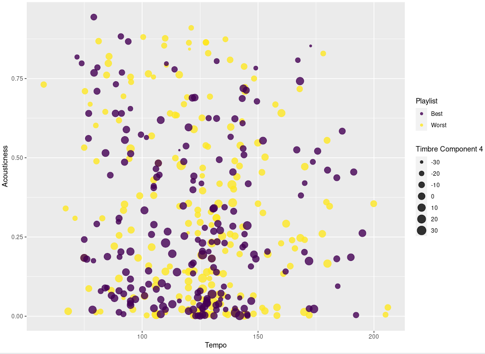

```{r setup, include=FALSE}
knitr::opts_chunk$set(echo = TRUE)

# include packages
library(flexdashboard)
library(readr)
library(tidyverse)
library(lubridate)
library(plotly)
library(patchwork)
library(spotifyr)
library(compmus)
library(purrr)
library(tidyr)
library(broom)
library(DT)
library(thematic)


# include environment
load("~/CompMus/R_data.RData")
```

### Can we predict a succesfull Eurovision track? {data-commentary-width=600}

```{r, fig.show="hold", out.width="35%", echo = FALSE, message = FALSE}

plot(dendorgram + theme_minimal() + ggtitle("Dendogram of Eurovision 2020"))
#ggplotly(IMPORTANCE + theme_minimal() + ggtitle("Features sorted on importance"))
```

***

Past analyses have shown how trends in Eurovision songs change over time, how some songs that are seen as 'generic' look in chroma and timbre SSMs and how research about music in general is similar or not to Eurovision music. The main question still remains unanswered: is it possible to predict if a song is successful or not on Eurovision based on it's features? To investigate this, different techniques where used.

**Dendogram**

First, dendograms where used to see how similar songs where based on the Spotify track features from one year of Eurovision. The top 5 consisted out of the songs "Think about things", "Fai Rumore", "UNO", "Move" and "YES". The lowest 5 consisted out of "Da Vidna", "FREAKY!", "YOU", "Prison" and "Divli Vietre". It is clear from the dendogram that the different classes of sons (top 5 or lowest 5) aren't really similar to each other. UNO, which ended third, is very different from the all other songs. "Divli Vietre", which ended in last place, is rather similar to "Fai Rumore", which ended second. The same thing goed for "You" and "Move". This dendogram only shows similarity for one year, but could give some insight: making predictions on classes that aren't very similar to one another might not give the best results.

**Random Forest**

Next up, two playlists were made containing the top 5 best or worst scoring songs for every year. These playlists were used to make a random forest model, which is a machine learning method that makes decision trees based on which features are most important for the categorization and uses these decision trees to classify a song as a 'successful' or 'unsuccessful'. The most important features were A, tempo, acousticness and timbre component 4. For class 'Successful' as well as "Unsuccessful", the precision was around 0.5, meaning that the model was able to classify a song correctly around 50% of the time. This means that the model works roughly as well as randomly assigning the songs to one of the classes. On the right, a visualization is shown based on some of the more important features: it is clear that there is a huge overlap between the two classes, so it is not weird that the model wasn't able to make sound predictions.


### Introduction: Sonfestival trough time {data-commentary-width=800}

<iframe width="1240" height="703" src="https://www.youtube.com/embed/DPzoydLh5YY" title="YouTube video player" frameborder="40" allow="accelerometer; autoplay; clipboard-write; encrypted-media; gyroscope; picture-in-picture" allowfullscreen></iframe>

***

My little sister is named after the song "Kleine kokette Katinka" by the Spelbrekers. This Dutch song, Netherland's submission for the Eurovision song contest in 1962, was the first song ever in the history of Eurovision to receive 0 points. I always thought this was very funny, and teased my sister with it. Thee videoclip of "Kleine Kokkete Katinka" (shown on the right) always interested me: Eurovision has changed a lot since then.

Since 1956, the Eurovision song festival has been held every year (apart from 2020), making it the longest-running annual international televised music competition and one of the world's longest-running television programmes. What do you need to compete as a country? An original song of three minutes or less, to be performed live by an artist or group. This results in a wide variety of songs every year, which makes Eurovision a very interesting event to analyse musically.

My questions are the following: are there trends in the Eurovision songs over time? And is it possible to device a global trend in music based on this? Is there a magic formula for making a successful and maybe even winning track? 

To do this, a corpus has been created containing the songs from the grand finale of Eurovision from 1980-2020, which sums up to 965 songs in total. I will try to find the answers to these questions analyzing this corpus using the Spotify API. The Spotify API keeps track of various music features, like valence, danceability, energy and much more. 

What stands out about the corpus is the variety in the songs. These range from beutiful calm jazz waltzs like "Amar pelos dos" by Salvador Sobral (winner of 2017) to "Hard Rock Hallelujah", a, as the name might suggest, hard rock song performed by Lordi (winner of 2007). 

Besides looking into the trends in Eurovision songs, I am also interested in seeing if the development in Eurovision music is similar to the development of music in general. Research shows that over time the timbral palette gets more homogene, pitch transitions get more restricted and levels of loudness grow (Serrà, Corral, Boguñá, Haro, Arcos, 2012). 


### Big lines in Eurovision {data-commentary-width=600}
 
```{r, echo = FALSE, message = FALSE}

ggplotly(trends + theme_minimal() + theme(legend.title = element_blank()))
```
***

Before we can start with a depth analysis, it might be nice to get an overall look of Eurovision and some of the track-level features from the Spotify API. This first plot serves as an overview of the global trends in Eurovision songs. The means of the Spotify's API features acousticness, danceability, energy and valence are shown over time. 

A few things that stand out about this graph:

- There is a drop in acousticness around 1999;
- In 1995 there seems to be a drop in acousticness, danceability and energy;
- The energy seems to be gradually going up, while valence seems to be going down.

The fun thing about Eurovision is that it is very well documented, and the effect of historical events or choices could show in the graphs. I will try to give my own interpretation or explanation of the noteworthy things in this graph.

**The drop in acousticness**

Around 1997 - 1999 the acousticness of Eurovision songs drops fast. This can be explained by a change in the rules of Eurovision. A live orchestra was a prominent feature of Eurovision from 1956-1998. In 1973 pre-recorded backing tracks were also allowed, but only if the instruments could still be seen 'playing' on stage. In 1997 it became allowed to pre-record all instrumental music, but the host country was still required to provide a live orchestra. From 1999, even the orchestra became optional, and as a cost-saving measure, 1999 therefore became the first ver Eurovision without an orchestra, meaning all the instrumentals were pre-recorded. It's very nice to see how the history of Eurovision can be seen in the statistics of just a simple line plot. Present day all instrumentals have to be pre-recorded, with only the singing remaining live (Wikipedia, 2022). 

**1995**

I have not yet found an explanation for the drop in valence, energy and danceability in 1995.

**Increasing energy, decreasing valence**

A subtle increase in energy can be seen in the graph over time. I would attribute this to changing popularity in music styles. The UK was the first country ever to enter the contest with a rap song called "Love City Groove" in 1995. Since then, new and more extreme musical styles are seen on Eurovision. Examples of this are "Toy" by Netta, which won in 2018 or, one of my personal favorites, "SHUM" by Go_A in 2021. 

I have not yet found an explanation for the decrease in valence.


### The typical Eurovision song {data-commentary-width=600}


```{r, figures-side, fig.show="hold", out.width="33%", echo = FALSE, message = FALSE}
par(mar = c(4, 4, .1, .1))
plot(grav_timbre + ggtitle("Timbre SSM of 'Gravity'") + theme_minimal())
plot(sugar_timbre + ggtitle("Timbre SSM of 'Sugar'") + theme_minimal())
plot(dance_timbre + ggtitle("Timbre SSM of 'Dance alone'") + theme_minimal())

plot(grav_chroma + ggtitle("Chroma SSM of 'Gravity'") + theme_minimal())
plot(sugar_chroma + ggtitle("Chroma SSM of 'Sugar'") + theme_minimal())
plot(dance_chroma + ggtitle("Chroma SSM of 'Dance alone'") + theme_minimal())
```

***

Over the years, there has been a lot of critique on the quality and producing of the Eurovision songs. Many songs entering the Eurovision song contest past years have been written by teams of international singer-songwriters just for the purpose of winning Eurovision, instead of an artists making their own song. At the 2001 contest, not one single entry was written with the involvement of foreign songwriters. This year, however, twenty-two songs were written with help from abroad (Keith, 2022). Numerous singer-songwriters even wrote multiple songs for the same edition of Eurovision, with a record of three songs for by the same writer in one year.

Many people feel like a great part of the Eurovision songs have become generic and don't reflect the countries and artists anymore. I have singled out three Eurovision songs that have been written by international Eurovision singer-songwriter veterans and that the internet has labeled as 'generic'. The SSM's shown on the right are created using the features timbre and chroma, to see if the structure of the songs is similar to one another. 

The SSM's are created for the folowing songs:  
- "Sugar" by Natalia Gordienko for Moldova (2021), written by Dimitris Kontopoulos;  
- "Gravity" by Hovig for Cyprus (2017), written by G:son;  
- "Dance alone" by Jana Burčeska for North Macedonia (2017), written by Borislav Milanov.  

The creators of these songs have written many Eurovision tracks, with some having won 1st, 2nd or 3rd place.

What stands out in the SSM's are the big blocks of homogeneity, that are repeated multiple times. This can be seen in the chroma features as well as in timbre. Another thing that caught my eye was the low variance of timbre in the songs "Sugar" and "Dance alone": the SSMs are relatively blue, meaning that there isn't much difference in use of different instruments throughout the song. In "Gravity" and "Dance alone", a few yellow horizontal and vertical stripes are present, meaning that that moment in the song differs a lot from the rest. In all songs, a checkerboard pattern can be discovered in the SSMs.

These repeated blocks of homogeneity can be one of the causes for the 'generic' feelings of the song. Their structure is simple and large parts (probably verses and choruses) are repeated. The instruments used don't show a wide range of variety, and there aren't parts of the song that particularly stand out except short moments, denoted by the yellow horizontal and vertical lines. 


### Research in Eurovision

```{r echo=FALSE, message=FALSE}

ggplotly(loudness + theme_minimal())

```

***

PLot loudness
- loudness neemt toe
- loudness ligt veel dichter bij elkaar

### SHUM in color {data-commentary-width=600}

```{r echo=FALSE, message=FALSE}

ggplotly(SHUM)

```

***

My favorite Eurovision song by far is SHUM by Go_A. This Ukrainian electro-folk banger was performed during Eurovision 2021, which was held in Rotterdam. SHUM finished runner-up in the public vote and eventuallt 5th in the while contest.  The lyrics of the song is entirely in Ukraine and is a variation of Ukrainian folk songs which were sung in the "Shum" folk ritual.  Shum refers to the god or personification of the forest.

Here we see a chromagram of SHUM. The song is nicely centered around E and B. 

### Tempo {data-commentary-width=600}

```{r, echo = FALSE, message = FALSE}
plot(dist_temp)
plot(Mean_tempo)

```

***

In the line plot the development of mean tempo over time is shown. There is no clear trend visible. The mean tempo does stay neatly between 110 and 135 BPM, which is the average tempo of music in general. 

In the histogram the distribution of tempi is shown of all the songfestival songs since 1980. The peak is at 120-130 BPM. The slowest tracks are "Moj Svijet" by Sergej Cetkovic, with a BPM of 53 and "Why Angels Cry" by Annet Artani with a BPM of 57. Both songs are calming and have a bit of a dramatic air to them.

The highest tempo with 216 BPM is ironically "Standing Still" by Roman Lob. When listening to the song however, it is clear that it does not have a very high tempo, but rather a slow one. --Explanation why Spotify messed up--


### Chordogram: Hard Rock Hallelujah {data-commentary-width=600}


```{r, echo = FALSE, message = FALSE}
plot(lordiplot)
```

***

Chordogram: Hard Rock Hallelujah


### Sources
Serrà, Joan, Álvaro Corral, Marián Boguñá, Martín Haro, and Josep Ll. Arcos. 2012. ‘Measuring the Evolution of Contemporary Western Popular Music’. Scientific Reports 2: 521.

Wikipedia contributors. (2022, February 21). Rules of the Eurovision Song Contest. Wikipedia. https://en.wikipedia.org/wiki/Rules_of_the_Eurovision_Song_Contest

Keith, E. (2022, February 15). Eurovision 2020: A breakdown of foreign composed songs. Wiwibloggs. https://wiwibloggs.com/2020/03/28/eurovision-2020-foreign-composed-songs/252694/
